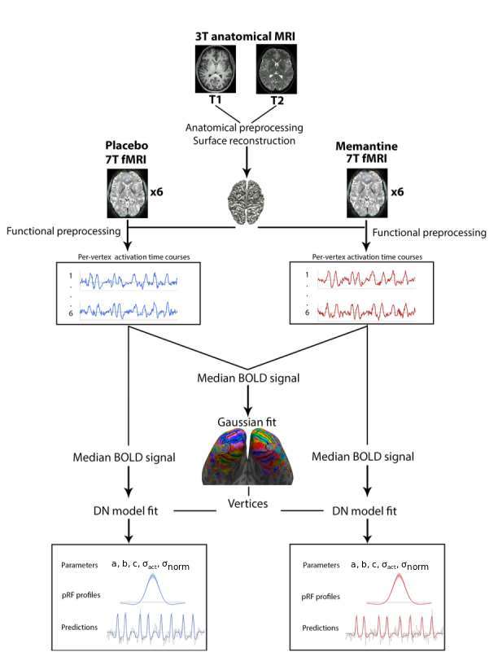

# The effect of Memantine on pRF characteristics in visual areas 

This repository includes the scripts for data analysis used for my Bioinformatics MSc thesis, written as part of my internship at the Spinoza Centre for Neuroimaging in Amsterdam. This project researched the effect of the NMDA-R antagonist Memantine on responses in 7T-fMRI population receptive fields (pRFs) characteristics in multiple visual areas using the following workflow: 

## Repository structure

The scripts included in this repository are divided into different folders:

### Analysis
This folder contains the script used to perform the analyses used in the thesis.

### Fitting
This folder includes scripts that were used to perform DN model fitting on the data from each condition separately using the Snellius supercomputing cluster.

### Retinotopy
This folder includes scripts that were used to draw and visualize ROIs based on the Gaussian fits on the data from the two experimental conditions pooled together.

## Requirements

Preprocessing of the fMRI data was done using in-house Spinoza pipelines, implemented using the `linescanning` repository. Scripts in this repository start from the preprocessed data. Analysis and fitting scripts used in this repository require prior installation of the following packages and software:

- `prfpy` ([link](https://github.com/VU-Cog-Sci/prfpy))
- `linescanning` ([link](https://github.com/gjheij/linescanning))
- `pycortex` (1.3.0)
- `nibabel` (4.0.1)
- `freeview` (version 7.3.2, part of `Freesurfer`)

The `spinoza_setup` file contains the necessary information to link the packages to the environment used in the Spinoza server. 

## Contact
For any questions or issues, please contact Maartje de Jong at m.dejong@spinozacentre.nl.
